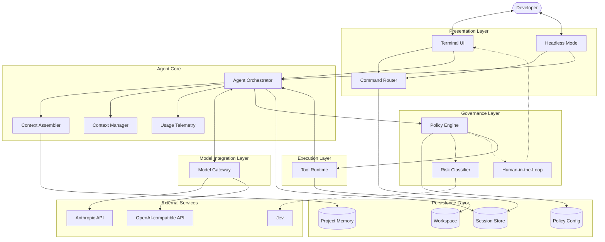

# code-agent

A small Claude Code-style coding agent for the terminal. Chat with a model that can read, search and
edit files and run shell commands in the current folder, asking you before anything risky.

Built with TypeScript on [Bun](https://bun.sh), with a React + [Ink](https://github.com/vadimdemedes/ink) terminal UI.

## Quick start

```sh
bun install
bun start            # needs ANTHROPIC_API_KEY
bun start --continue # pick up the last conversation in this folder (--resume [id] to choose)
```

Type a request at the `>` prompt (`/help` lists commands: `/clear`, `/model` to list and pick a model, `/effort low|medium|high|xhigh|max`, `/mode`, `/cost`, `/compact`, `/resume`, `/rewind`, `/status`, `/permissions`, `/memory`, `/init`, `/export`, `/exit`). Replies stream as they are written; Ctrl+C cancels the
current reply (twice, or at an empty prompt, quits); `exit` quits. Each turn ends with a token line;
conversations are saved under `~/.code-agent/projects/` (set `CODE_AGENT_HOME` to move it).
Long conversations are summarized automatically once a prompt passes `COMPACT_AT_TOKENS` (default 200000).

Project instructions: put them in `AGENT.md`, `AGENTS.md` or `CLAUDE.md`. Files in the current folder
and every parent folder are added to the model's instructions each turn.

## Models

| Backend | How |
|---|---|
| Claude (default) | `ANTHROPIC_API_KEY=...`; `LLM_MODEL` overrides the model (default `claude-opus-5`) |
| OpenAI / compatible | `LLM_PROVIDER=openai LLM_MODEL=<id>` + `OPENAI_API_KEY`; set `OPENAI_BASE_URL` for Ollama, OpenRouter, Groq, LM Studio |

Bun loads a `.env` file automatically.

## Tools

`read_file`, `write_file`, `edit_file`, `list_dir`, `glob`, `grep`, `run_command`.

## Safety

- Reads and searches inside the project run without asking.
- Writes, edits and shell commands ask for approval (`y/N`, or `a` to always allow it this session).
- Read-only commands like `git status` or `ls` skip the prompt. Commands with `; & | < > $` always ask.
- Optional: set `TYPESAFE_API_KEY` to let [Jev](https://typesafe.ai/) auto-approve other commands it is
  very sure only read. Without the key, those commands ask.
- `/mode accept-edits` auto-approves edits inside the project; `/mode plan` is read-only.
- Rules in `.code-agent/settings.json` (deny wins, then plan mode, then allow):

  ```json
  {
    "mode": "default",
    "permissions": {
      "allow": ["run_command(npm test*)", "write_file(src/*)"],
      "deny": ["run_command(rm *)", "read_file(.env)"]
    }
  }
  ```

## Architecture



| Layer | Responsibility |
|---|---|
| **Presentation** | Takes input and renders output; the interactive terminal and piped mode share one command router. |
| **Agent Core** | The **Agent Orchestrator** runs the reasoning loop: call the model, dispatch tool calls, repeat until it answers. The **Context Assembler** builds the instructions, the **Context Manager** keeps the conversation inside the context window, and **Usage Telemetry** tracks tokens and cache hit rate. |
| **Governance** | Every tool call passes the **Policy Engine** (deny/allow rules, permission mode), which can consult the **Risk Classifier** and escalate to the user for approval. |
| **Execution** | The **Tool Runtime** runs authorized calls against the workspace and returns results to the orchestrator. |
| **Model Integration** | The **Model Gateway** hides the provider behind one interface and handles streaming and prompt caching. |
| **Persistence** | Project files, memory files, policy configuration and saved conversations. |

## Development

```sh
bun test             # tests (no real API calls)
bun run typecheck    # tsc --noEmit
```
